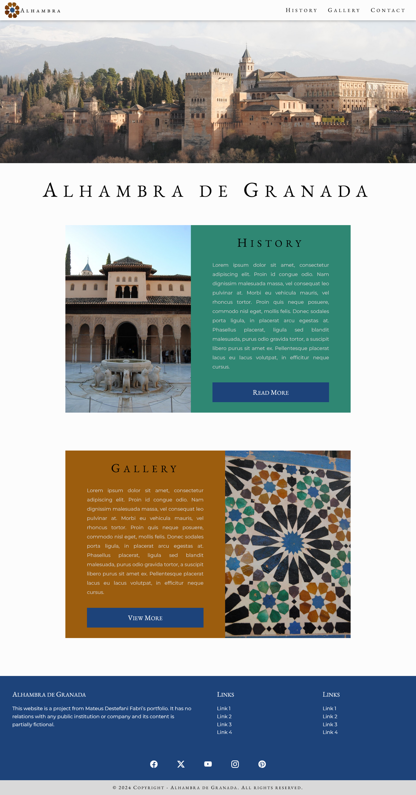

# Home page for Alhambra de Granada

In this project I developed a home page for the monument Alhambra de Granada, located in Spain.

The website was built with a mobile-first approach aiming responsive web design (focus on mobile and desktop versions).

Built only with HTML and CSS, no frameworks were used.

The design was created by me using Figma.

It is online and can be accessed at the link [alhambra.free.nf](http://www.alhambra.free.nf)

More information about me on [LinkedIn](https://www.linkedin.com/in/mateus-destefani-fabri-44b205232/).

## Screenshots

### Mobile version

### Desktop version

